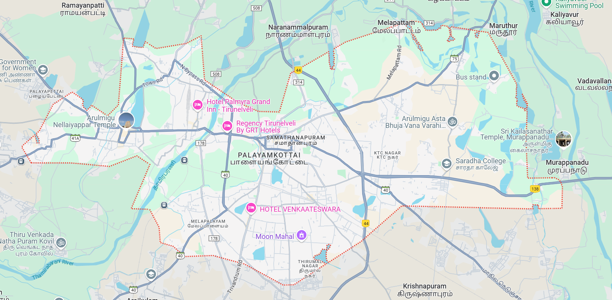
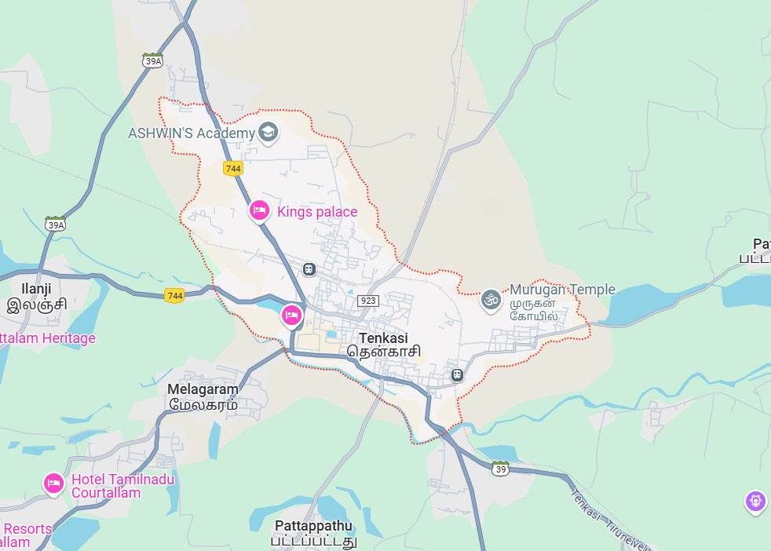
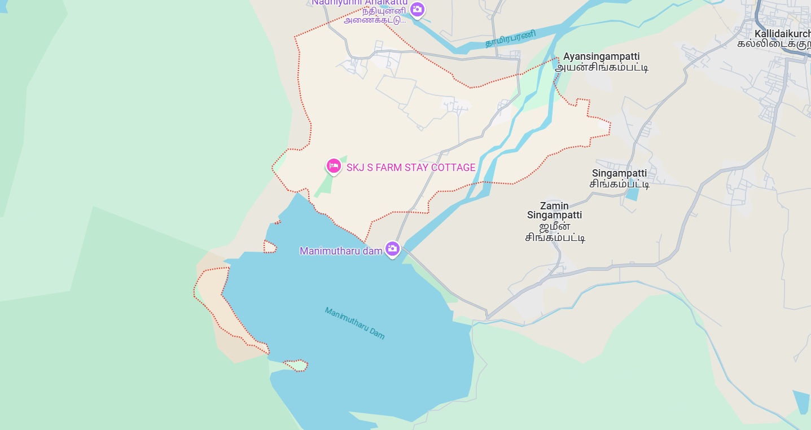
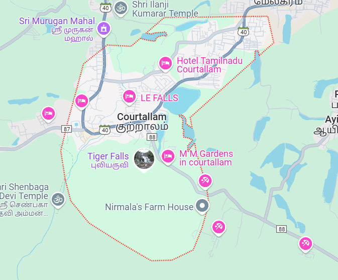

# Ex04 Places Around Me
## Date: 23/04/25

## AIM
To develop a website to display details about the places around my house.

## DESIGN STEPS

### STEP 1
Create a Django admin interface.

### STEP 2
Download your city map from Google.

### STEP 3
Using ```<map>``` tag name the map.

### STEP 4
Create clickable regions in the image using ```<area>``` tag.

### STEP 5
Write HTML programs for all the regions identified.

### STEP 6
Execute the programs and publish them.

## CODE
<html>
<head>
    <title>Tirunelveli Region Map</title>
</head>
<body bgcolor="lightblue">
    <h1 align="center"><font color="darkgreen"><b>Tirunelveli Region</b></font></h1>
    <center>
        
        <map name="TvlMap">
            <area shape="circle" coords="300,400,20" href="tirunelveli.html" title="Tirunelveli">
            <area shape="circle" coords="200,500,20" href="tenkasi.html" title="Tenkasi">
            <area shape="circle" coords="250,550,20" href="courtallam.html" title="Courtallam">
            <area shape="circle" coords="350,450,20" href="ambasamudram.html" title="Ambasamudram">
            <area shape="circle" coords="400,500,20" href="manimuthar.html" title="Manimuthar">
        </map>
    </center>
</body>
</html>

## OUTPUT

## RESULT
The program for implementing image maps using HTML is executed successfully.
